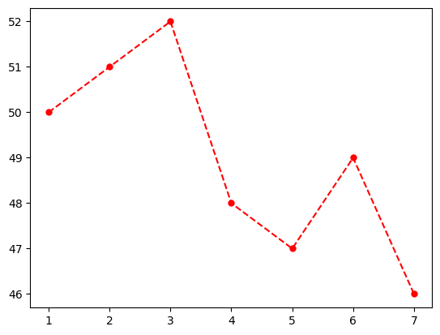

[](https://colab.research.google.com/github/pulakeshpradhan/python/blob/main/docs/data-science/Data-Science-Bootcamp-with-Python/05_Introduction_to_Matplotlib/02_Format_Strings_in_plot_Function.ipynb)

# Format Strings in plot() Function
In Matplotlib, you can customize the appearance of data points in a plot using format strings in the plot() function. A format string is a shorthand way of specifying the color, marker, and line style of the plot.

A format string consists of one or more characters that represent the color, marker, and line style of the plot. The characters are specified in a specific order: first the color, then the marker, and finally the line style. Each component is represented by a single character code.

[Click Here to Check the Documentation of plot() Function](https://matplotlib.org/3.5.3/api/_as_gen/matplotlib.pyplot.plot.html#matplotlib.pyplot.plot)
<br>


```python
import matplotlib.pyplot as plt
%matplotlib inline
```


```python
# Creating two variables
days = [1, 2, 3, 4, 5, 6, 7]
temperature = [50, 51, 52, 48, 47, 49, 46]
```

## 01. Plotting Using Format String
Here are the most commonly used codes:
* Color codes: b (blue), g (green), r (red), c (cyan), m (magenta), y (yellow), k (black), w (white)
* Marker codes: . (point), o (circle), v (downward-pointing triangle), ^ (upward-pointing triangle), s (square), + (plus), x (cross), * (star), p (pentagon), h (hexagon)
* Line style codes: - (solid), -- (dashed), : (dotted), -. (dash-dot)


```python
plt.plot(days, temperature, "r.--")
```


    [<matplotlib.lines.Line2D at 0x220c2648070>]


    

    


```python
# Plotting with keyword arguments
plt.plot(days, temperature, color="r", marker=".", linestyle="--", markersize=10)
```


    [<matplotlib.lines.Line2D at 0x220c268da00>]


    

    


```python
plt.plot(days, temperature, color="#58508d", marker="D", linestyle="", markersize=5)
```


    [<matplotlib.lines.Line2D at 0x220c2712370>]


    

    


```python
plt.plot(days, temperature, color="#58508d", marker="D", linestyle="", markersize=5)
```


    [<matplotlib.lines.Line2D at 0x220c2796220>]


    

    


## 02. alpha Property for plot API
In Matplotlib, the alpha property of the plot() function can be used to adjust the transparency of data points, lines, and other plot elements.

The alpha property takes a value between 0 and 1, where 0 is completely transparent and 1 is completely opaque. By default, the value of alpha is 1, which means that plot elements are fully opaque.


```python
plt.plot(days, temperature, color="#367635",marker=".", markersize=10, linestyle="--", alpha=0.5)
```


    [<matplotlib.lines.Line2D at 0x220c2890400>]


    

    

