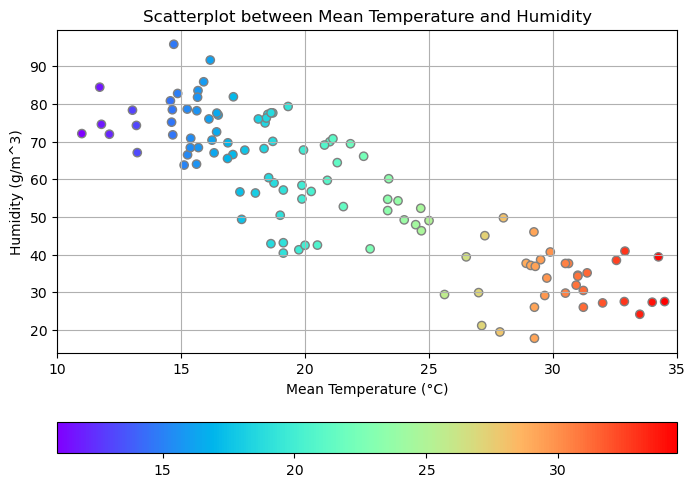

# **Decision Tree Classifier**

## **Importing Required Libraries**


```python
import os
import numpy as np
import pandas as pd
import matplotlib.pyplot as plt
import seaborn as sns
import warnings
warnings.filterwarnings("ignore")
```

## **Setting Up the Current Working Directory**


```python
# Checking the current working directory
print(os.getcwd())
```

    D:\Coding\Git Repository\Data-Science-Bootcamp-with-Python\07_Decision_Tree
    


```python
# Changing the location of the current working directory
file_path = "D:\Coding\Git Repository\Data-Science-Bootcamp-with-Python\Datasets"
os.chdir(file_path)
```


```python
# Checking the working directory location
print(os.getcwd())
```

    D:\Coding\Git Repository\Data-Science-Bootcamp-with-Python\Datasets
    

## **Reading the Dataset using Pandas**


```python
# Reading the DailyDelhiClimateTest.csv data
dataset = "DailyDelhiClimateTest.csv"
data_path = file_path + "\\" + dataset
df = pd.read_csv(data_path)
```


```python
# Checking the dataframe
df.head()
```


<div>
<style scoped>
    .dataframe tbody tr th:only-of-type {
        vertical-align: middle;
    }

    .dataframe tbody tr th {
        vertical-align: top;
    }

    .dataframe thead th {
        text-align: right;
    }
</style>
<table border="1" class="dataframe">
  <thead>
    <tr style="text-align: right;">
      <th></th>
      <th>date</th>
      <th>meantemp</th>
      <th>humidity</th>
      <th>wind_speed</th>
      <th>meanpressure</th>
    </tr>
  </thead>
  <tbody>
    <tr>
      <th>0</th>
      <td>2017-01-01</td>
      <td>15.913043</td>
      <td>85.869565</td>
      <td>2.743478</td>
      <td>59.000000</td>
    </tr>
    <tr>
      <th>1</th>
      <td>2017-01-02</td>
      <td>18.500000</td>
      <td>77.222222</td>
      <td>2.894444</td>
      <td>1018.277778</td>
    </tr>
    <tr>
      <th>2</th>
      <td>2017-01-03</td>
      <td>17.111111</td>
      <td>81.888889</td>
      <td>4.016667</td>
      <td>1018.333333</td>
    </tr>
    <tr>
      <th>3</th>
      <td>2017-01-04</td>
      <td>18.700000</td>
      <td>70.050000</td>
      <td>4.545000</td>
      <td>1015.700000</td>
    </tr>
    <tr>
      <th>4</th>
      <td>2017-01-05</td>
      <td>18.388889</td>
      <td>74.944444</td>
      <td>3.300000</td>
      <td>1014.333333</td>
    </tr>
  </tbody>
</table>
</div>


```python
# Checking the shape of the dataframe
df.shape
```


    (114, 5)


```python
# Printing the column names
df.columns
```


    Index(['date', 'meantemp', 'humidity', 'wind_speed', 'meanpressure'], dtype='object')


```python
# Checking the datatype of all the columns
df.dtypes
```


    date             object
    meantemp        float64
    humidity        float64
    wind_speed      float64
    meanpressure    float64
    dtype: object


## **Data Cleaning and Preprocessing**


```python
# Checking the dataframe whether there is any null value or not
df.isnull().sum()
```


    date            0
    meantemp        0
    humidity        0
    wind_speed      0
    meanpressure    0
    dtype: int64


```python
# Removing the data column from the dataset
df.drop(["date"], axis=1, inplace=True)
```


```python
# Checking the shape of the data
df.shape
```


    (114, 4)


```python
# Creating a blank array
array = []

# Generating a for loop to categorize the humidity into 3 levels
for i in df["humidity"]:
    if i < 40:
        array.append(1)
    elif i >= 40 and i < 60:
        array.append(2)
    else:
        array.append(3)
```


```python
# Converting the array into numpy array
array = np.array(array)
array
```


    array([3, 3, 3, 3, 3, 3, 3, 3, 3, 3, 3, 3, 3, 3, 3, 3, 3, 3, 3, 3, 3, 3,
           3, 3, 3, 3, 3, 3, 3, 3, 3, 3, 3, 3, 3, 3, 3, 3, 3, 3, 3, 3, 3, 3,
           3, 3, 2, 3, 3, 3, 3, 3, 2, 2, 2, 2, 2, 2, 2, 2, 2, 2, 2, 2, 2, 2,
           2, 3, 3, 3, 2, 2, 2, 2, 2, 2, 2, 2, 2, 2, 2, 2, 1, 1, 1, 1, 2, 1,
           1, 1, 1, 1, 1, 1, 2, 1, 1, 1, 1, 1, 1, 1, 1, 1, 1, 1, 1, 1, 1, 1,
           1, 2, 1, 1])


```python
# Adding the humidity level data into the main dataframe
df["humidity_level"] = array
```


```python
# Checking the dataframe after adding 'humidity_level' column
df.head()
```


<div>
<style scoped>
    .dataframe tbody tr th:only-of-type {
        vertical-align: middle;
    }

    .dataframe tbody tr th {
        vertical-align: top;
    }

    .dataframe thead th {
        text-align: right;
    }
</style>
<table border="1" class="dataframe">
  <thead>
    <tr style="text-align: right;">
      <th></th>
      <th>meantemp</th>
      <th>humidity</th>
      <th>wind_speed</th>
      <th>meanpressure</th>
      <th>humidity_level</th>
    </tr>
  </thead>
  <tbody>
    <tr>
      <th>0</th>
      <td>15.913043</td>
      <td>85.869565</td>
      <td>2.743478</td>
      <td>59.000000</td>
      <td>3</td>
    </tr>
    <tr>
      <th>1</th>
      <td>18.500000</td>
      <td>77.222222</td>
      <td>2.894444</td>
      <td>1018.277778</td>
      <td>3</td>
    </tr>
    <tr>
      <th>2</th>
      <td>17.111111</td>
      <td>81.888889</td>
      <td>4.016667</td>
      <td>1018.333333</td>
      <td>3</td>
    </tr>
    <tr>
      <th>3</th>
      <td>18.700000</td>
      <td>70.050000</td>
      <td>4.545000</td>
      <td>1015.700000</td>
      <td>3</td>
    </tr>
    <tr>
      <th>4</th>
      <td>18.388889</td>
      <td>74.944444</td>
      <td>3.300000</td>
      <td>1014.333333</td>
      <td>3</td>
    </tr>
  </tbody>
</table>
</div>


## **Data Exploration and Visualization**


```python
# Visualizing the correlations between variables
plt.figure(figsize=(8, 6))
sns.heatmap(df.corr(), annot=True, cmap="RdYlGn")
plt.title("Correlation between Variables")
plt.show()
```


    

    


```python
# Visualizing the Scatterplot between mean temperature and humidity
plt.figure(figsize=(8, 6))
plt.scatter(x=df["meantemp"], y=df["humidity"], cmap="rainbow", c=df["meantemp"], edgecolor="gray")
plt.grid()
plt.colorbar(orientation="horizontal")
plt.title("Scatterplot between Mean Temperature and Humidity")
plt.xlabel("Mean Temperature (°C)")
plt.xlim(10, 35)
plt.ylabel("Humidity (g/m^3)")
plt.show()
```


    

    


## **Preparing the Training and Testing Dataset**


```python
# Selecting the independent and dependent variable
x = df[["meantemp", "wind_speed"]]
y = df[["humidity_level"]]
```


```python
# Importing train_test_split from sklearn library
from sklearn.model_selection import train_test_split
```


```python
# Preparing training and testing dataset
x_train, x_test, y_train, y_test = train_test_split(x, y, test_size=0.3, random_state=20)
```

## **Instantiating the Decision Tree Classifier Model**


```python
# Importing the decision tree classifier model
from sklearn.tree import DecisionTreeClassifier
```


```python
# Instantiating the model
treeModel = DecisionTreeClassifier()
# Fitting the training data to the model
treeModel.fit(x_train, y_train)
```


<style>#sk-container-id-1 {color: black;background-color: white;}#sk-container-id-1 pre{padding: 0;}#sk-container-id-1 div.sk-toggleable {background-color: white;}#sk-container-id-1 label.sk-toggleable__label {cursor: pointer;display: block;width: 100%;margin-bottom: 0;padding: 0.3em;box-sizing: border-box;text-align: center;}#sk-container-id-1 label.sk-toggleable__label-arrow:before {content: "▸";float: left;margin-right: 0.25em;color: #696969;}#sk-container-id-1 label.sk-toggleable__label-arrow:hover:before {color: black;}#sk-container-id-1 div.sk-estimator:hover label.sk-toggleable__label-arrow:before {color: black;}#sk-container-id-1 div.sk-toggleable__content {max-height: 0;max-width: 0;overflow: hidden;text-align: left;background-color: #f0f8ff;}#sk-container-id-1 div.sk-toggleable__content pre {margin: 0.2em;color: black;border-radius: 0.25em;background-color: #f0f8ff;}#sk-container-id-1 input.sk-toggleable__control:checked~div.sk-toggleable__content {max-height: 200px;max-width: 100%;overflow: auto;}#sk-container-id-1 input.sk-toggleable__control:checked~label.sk-toggleable__label-arrow:before {content: "▾";}#sk-container-id-1 div.sk-estimator input.sk-toggleable__control:checked~label.sk-toggleable__label {background-color: #d4ebff;}#sk-container-id-1 div.sk-label input.sk-toggleable__control:checked~label.sk-toggleable__label {background-color: #d4ebff;}#sk-container-id-1 input.sk-hidden--visually {border: 0;clip: rect(1px 1px 1px 1px);clip: rect(1px, 1px, 1px, 1px);height: 1px;margin: -1px;overflow: hidden;padding: 0;position: absolute;width: 1px;}#sk-container-id-1 div.sk-estimator {font-family: monospace;background-color: #f0f8ff;border: 1px dotted black;border-radius: 0.25em;box-sizing: border-box;margin-bottom: 0.5em;}#sk-container-id-1 div.sk-estimator:hover {background-color: #d4ebff;}#sk-container-id-1 div.sk-parallel-item::after {content: "";width: 100%;border-bottom: 1px solid gray;flex-grow: 1;}#sk-container-id-1 div.sk-label:hover label.sk-toggleable__label {background-color: #d4ebff;}#sk-container-id-1 div.sk-serial::before {content: "";position: absolute;border-left: 1px solid gray;box-sizing: border-box;top: 0;bottom: 0;left: 50%;z-index: 0;}#sk-container-id-1 div.sk-serial {display: flex;flex-direction: column;align-items: center;background-color: white;padding-right: 0.2em;padding-left: 0.2em;position: relative;}#sk-container-id-1 div.sk-item {position: relative;z-index: 1;}#sk-container-id-1 div.sk-parallel {display: flex;align-items: stretch;justify-content: center;background-color: white;position: relative;}#sk-container-id-1 div.sk-item::before, #sk-container-id-1 div.sk-parallel-item::before {content: "";position: absolute;border-left: 1px solid gray;box-sizing: border-box;top: 0;bottom: 0;left: 50%;z-index: -1;}#sk-container-id-1 div.sk-parallel-item {display: flex;flex-direction: column;z-index: 1;position: relative;background-color: white;}#sk-container-id-1 div.sk-parallel-item:first-child::after {align-self: flex-end;width: 50%;}#sk-container-id-1 div.sk-parallel-item:last-child::after {align-self: flex-start;width: 50%;}#sk-container-id-1 div.sk-parallel-item:only-child::after {width: 0;}#sk-container-id-1 div.sk-dashed-wrapped {border: 1px dashed gray;margin: 0 0.4em 0.5em 0.4em;box-sizing: border-box;padding-bottom: 0.4em;background-color: white;}#sk-container-id-1 div.sk-label label {font-family: monospace;font-weight: bold;display: inline-block;line-height: 1.2em;}#sk-container-id-1 div.sk-label-container {text-align: center;}#sk-container-id-1 div.sk-container {/* jupyter's `normalize.less` sets `[hidden] { display: none; }` but bootstrap.min.css set `[hidden] { display: none !important; }` so we also need the `!important` here to be able to override the default hidden behavior on the sphinx rendered scikit-learn.org. See: https://github.com/scikit-learn/scikit-learn/issues/21755 */display: inline-block !important;position: relative;}#sk-container-id-1 div.sk-text-repr-fallback {display: none;}</style><div id="sk-container-id-1" class="sk-top-container"><div class="sk-text-repr-fallback"><pre>DecisionTreeClassifier()</pre><b>In a Jupyter environment, please rerun this cell to show the HTML representation or trust the notebook. <br />On GitHub, the HTML representation is unable to render, please try loading this page with nbviewer.org.</b></div><div class="sk-container" hidden><div class="sk-item"><div class="sk-estimator sk-toggleable"><input class="sk-toggleable__control sk-hidden--visually" id="sk-estimator-id-1" type="checkbox" checked><label for="sk-estimator-id-1" class="sk-toggleable__label sk-toggleable__label-arrow">DecisionTreeClassifier</label><div class="sk-toggleable__content"><pre>DecisionTreeClassifier()</pre></div></div></div></div></div>


```python
# Visualizing the tree split of the model
from sklearn import tree
plt.figure(figsize=(14, 10))
tree.plot_tree(treeModel, filled=True, rounded=True)
plt.show()
```


    

    


```python
# Applying post prunning technique
treeModel2 = DecisionTreeClassifier(max_depth=2)
# Fitting the training data to the model
treeModel2.fit(x_train, y_train)
```


<style>#sk-container-id-2 {color: black;background-color: white;}#sk-container-id-2 pre{padding: 0;}#sk-container-id-2 div.sk-toggleable {background-color: white;}#sk-container-id-2 label.sk-toggleable__label {cursor: pointer;display: block;width: 100%;margin-bottom: 0;padding: 0.3em;box-sizing: border-box;text-align: center;}#sk-container-id-2 label.sk-toggleable__label-arrow:before {content: "▸";float: left;margin-right: 0.25em;color: #696969;}#sk-container-id-2 label.sk-toggleable__label-arrow:hover:before {color: black;}#sk-container-id-2 div.sk-estimator:hover label.sk-toggleable__label-arrow:before {color: black;}#sk-container-id-2 div.sk-toggleable__content {max-height: 0;max-width: 0;overflow: hidden;text-align: left;background-color: #f0f8ff;}#sk-container-id-2 div.sk-toggleable__content pre {margin: 0.2em;color: black;border-radius: 0.25em;background-color: #f0f8ff;}#sk-container-id-2 input.sk-toggleable__control:checked~div.sk-toggleable__content {max-height: 200px;max-width: 100%;overflow: auto;}#sk-container-id-2 input.sk-toggleable__control:checked~label.sk-toggleable__label-arrow:before {content: "▾";}#sk-container-id-2 div.sk-estimator input.sk-toggleable__control:checked~label.sk-toggleable__label {background-color: #d4ebff;}#sk-container-id-2 div.sk-label input.sk-toggleable__control:checked~label.sk-toggleable__label {background-color: #d4ebff;}#sk-container-id-2 input.sk-hidden--visually {border: 0;clip: rect(1px 1px 1px 1px);clip: rect(1px, 1px, 1px, 1px);height: 1px;margin: -1px;overflow: hidden;padding: 0;position: absolute;width: 1px;}#sk-container-id-2 div.sk-estimator {font-family: monospace;background-color: #f0f8ff;border: 1px dotted black;border-radius: 0.25em;box-sizing: border-box;margin-bottom: 0.5em;}#sk-container-id-2 div.sk-estimator:hover {background-color: #d4ebff;}#sk-container-id-2 div.sk-parallel-item::after {content: "";width: 100%;border-bottom: 1px solid gray;flex-grow: 1;}#sk-container-id-2 div.sk-label:hover label.sk-toggleable__label {background-color: #d4ebff;}#sk-container-id-2 div.sk-serial::before {content: "";position: absolute;border-left: 1px solid gray;box-sizing: border-box;top: 0;bottom: 0;left: 50%;z-index: 0;}#sk-container-id-2 div.sk-serial {display: flex;flex-direction: column;align-items: center;background-color: white;padding-right: 0.2em;padding-left: 0.2em;position: relative;}#sk-container-id-2 div.sk-item {position: relative;z-index: 1;}#sk-container-id-2 div.sk-parallel {display: flex;align-items: stretch;justify-content: center;background-color: white;position: relative;}#sk-container-id-2 div.sk-item::before, #sk-container-id-2 div.sk-parallel-item::before {content: "";position: absolute;border-left: 1px solid gray;box-sizing: border-box;top: 0;bottom: 0;left: 50%;z-index: -1;}#sk-container-id-2 div.sk-parallel-item {display: flex;flex-direction: column;z-index: 1;position: relative;background-color: white;}#sk-container-id-2 div.sk-parallel-item:first-child::after {align-self: flex-end;width: 50%;}#sk-container-id-2 div.sk-parallel-item:last-child::after {align-self: flex-start;width: 50%;}#sk-container-id-2 div.sk-parallel-item:only-child::after {width: 0;}#sk-container-id-2 div.sk-dashed-wrapped {border: 1px dashed gray;margin: 0 0.4em 0.5em 0.4em;box-sizing: border-box;padding-bottom: 0.4em;background-color: white;}#sk-container-id-2 div.sk-label label {font-family: monospace;font-weight: bold;display: inline-block;line-height: 1.2em;}#sk-container-id-2 div.sk-label-container {text-align: center;}#sk-container-id-2 div.sk-container {/* jupyter's `normalize.less` sets `[hidden] { display: none; }` but bootstrap.min.css set `[hidden] { display: none !important; }` so we also need the `!important` here to be able to override the default hidden behavior on the sphinx rendered scikit-learn.org. See: https://github.com/scikit-learn/scikit-learn/issues/21755 */display: inline-block !important;position: relative;}#sk-container-id-2 div.sk-text-repr-fallback {display: none;}</style><div id="sk-container-id-2" class="sk-top-container"><div class="sk-text-repr-fallback"><pre>DecisionTreeClassifier(max_depth=2)</pre><b>In a Jupyter environment, please rerun this cell to show the HTML representation or trust the notebook. <br />On GitHub, the HTML representation is unable to render, please try loading this page with nbviewer.org.</b></div><div class="sk-container" hidden><div class="sk-item"><div class="sk-estimator sk-toggleable"><input class="sk-toggleable__control sk-hidden--visually" id="sk-estimator-id-2" type="checkbox" checked><label for="sk-estimator-id-2" class="sk-toggleable__label sk-toggleable__label-arrow">DecisionTreeClassifier</label><div class="sk-toggleable__content"><pre>DecisionTreeClassifier(max_depth=2)</pre></div></div></div></div></div>


```python
# Visualizing the tree split after post prunning
plt.figure(figsize=(12, 6))
tree.plot_tree(treeModel2, filled=True, rounded=True)
plt.show()
```


    

    


## **Validation of the Model**


```python
# Predict the test data using the decision tree model
y_pred = treeModel2.predict(x_test)
```


```python
# Import the model validation metrics from the sklearn library
from sklearn.metrics import accuracy_score, classification_report
```


```python
score = accuracy_score(y_test, y_pred)
print("Model Score: ", score)
```

    Model Score:  0.7142857142857143
    


```python
print(classification_report(y_test, y_pred))
```

                  precision    recall  f1-score   support
    
               1       0.70      1.00      0.82         7
               2       0.40      0.50      0.44         8
               3       0.93      0.70      0.80        20
    
        accuracy                           0.71        35
       macro avg       0.68      0.73      0.69        35
    weighted avg       0.76      0.71      0.72        35
    
    
